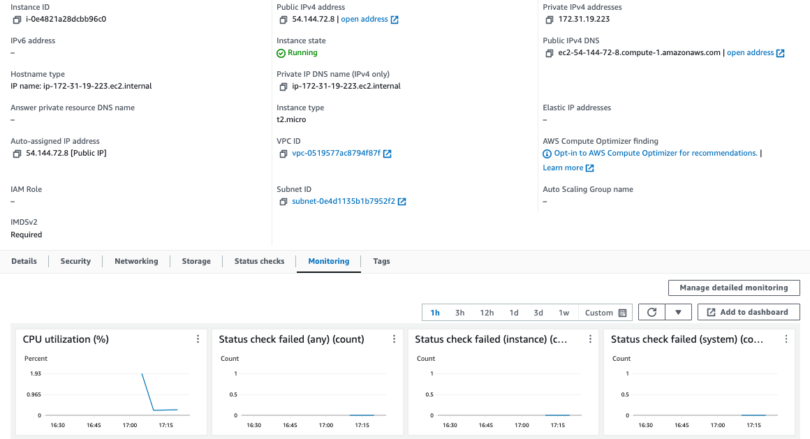

# My first ec2 instance (aka hello aws terraform world)


## Summary 
As per [terraform cli log file (tf.log)](tf.log)

* Initially hit a permissions error
* Then was able to deploy my ec2 instance (i-0e4821a28dcbb96c0)

## Instructions (from "HashiCorp Certified Terraform: Associate 2023")


### first_ec2.tf

```sh
provider "aws" {
  region     = "us-east-1"
  access_key = "PUT-YOUR-ACCESS-KEY-HERE"
  secret_key = "PUT-YOUR-SECRET-KEY-HERE"
}

resource "aws_instance" "myec2" {
    ami = "ami-00c39f71452c08778"
    instance_type = "t2.micro"
}
```

### Commands:

```sh
terraform init
terraform plan
terraform apply
```


## Initially hit a permissions error


```
(base) ~/projects/terraform-beginner-to-advanced-resource/Section 1 - Deploying Infrastructure with Terraform/first_ec2 $ terraform plan

Planning failed. Terraform encountered an error while generating this plan.

╷
│ Error: configuring Terraform AWS Provider: validating provider credentials: retrieving caller identity from STS: operation error STS: GetCallerIdentity, https response error StatusCode: 403, RequestID: c8d2571b-746a-49fe-b53e-b57842c5174c, api error InvalidClientTokenId: The security token included in the request is invalid.
│ 
│   with provider["registry.terraform.io/hashicorp/aws"],
│   on main.tf line 1, in provider "aws":
│    1: provider "aws" {
```

after checking via `aws sts get-caller-identity`
```
$ aws sts get-caller-identity
{
    "UserId": "AIDA4BMBNMBVLFQDKFVOW",
    "Account": "827589484650",
    "Arn": "arn:aws:iam::827589484650:user/ec2-base-admin"
}
```
the problem was that while I had setup access_key and secret_key in my private .aws directory, the script was trying to override these


```
  access_key = "PUT-YOUR-ACCESS-KEY-HERE"
  secret_key = "PUT-YOUR-SECRET-KEY-HERE"
```


## Then was able to deploy my ec2 instance 
```
provider "aws" {
  region     = "us-east-1"
}

resource "aws_instance" "myec2" {
    ami = "ami-00c39f71452c08778"
    instance_type = "t2.micro"
}
```


Here is a screenshot / GUI image of myec2 instance (i-0e4821a28dcbb96c0):


